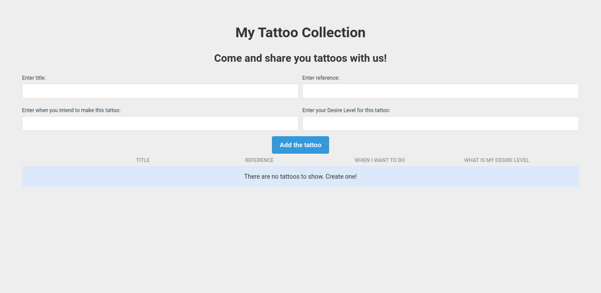

# my-tattoo-collection-react-sqlite-app

## Click to See the Demo

App for recording all tattoos you wanna do in your body, built with React, Express and SQLite.

## Stack
- Database: SQLite
- Backend: Nodejs + Express
- FrontEnd: ReactJs

## How to install
In your terminal, use: 

`git clone https://github.com/laionazeredo/my-tattoo-collection-react-sqlite-app.git`

After cloning, go to:

`cd my-tattoo-collection-react-sqlite-app`

and, once inside the directory:

`npm install`

This will install all the dependencies you need to start the app.

## How to initiate

Open you terminal and do:

`cd server`

This will get you inside the server subdirectory.
Then, do:

`node server.js`

This will start you Express server, listening at 4001 port.
In another terminal window, do:

`npm start`

This will start your react app at 3000 port.

## Future issues

- More API endpoints
- Capability to upload images
- Better UI
